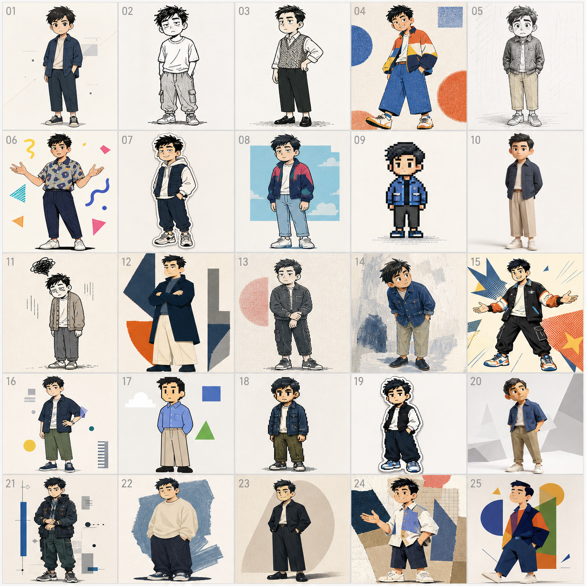
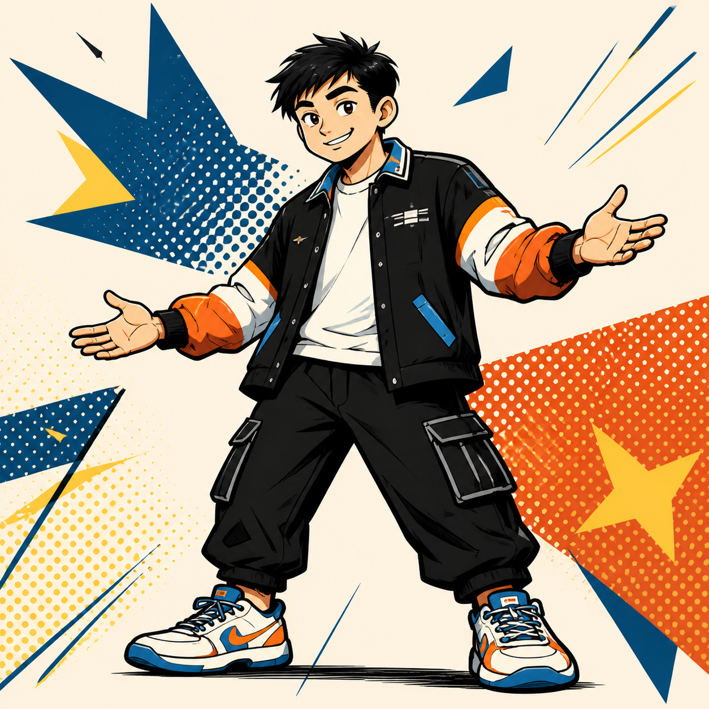
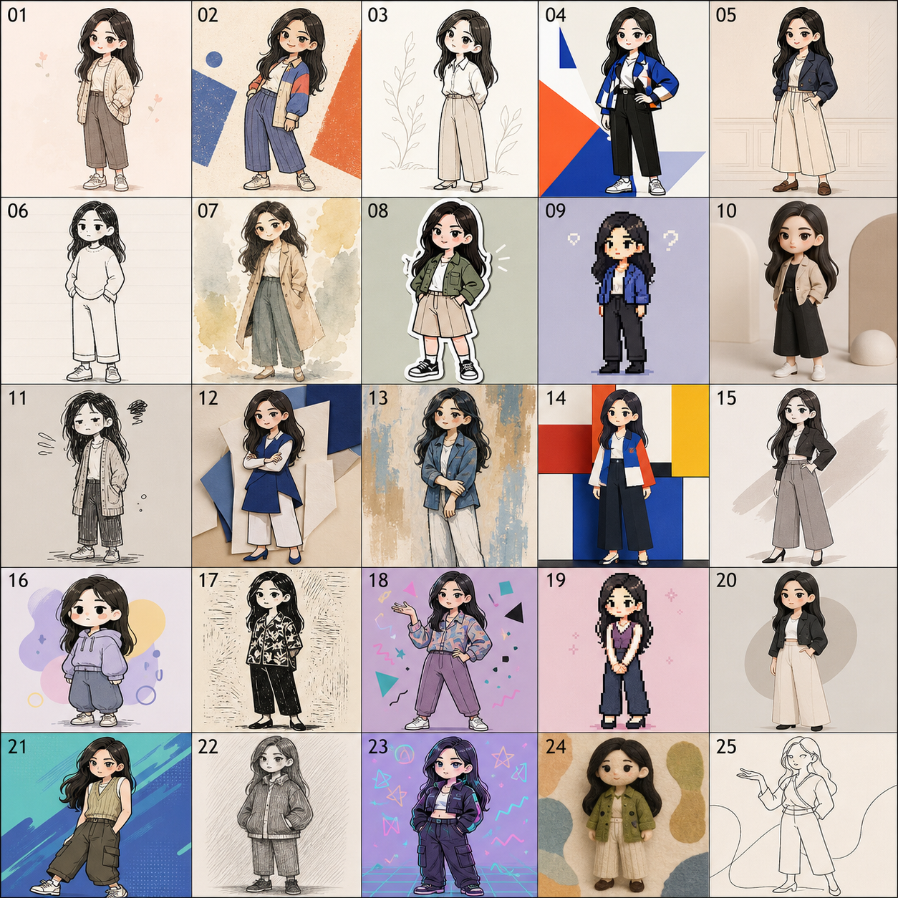
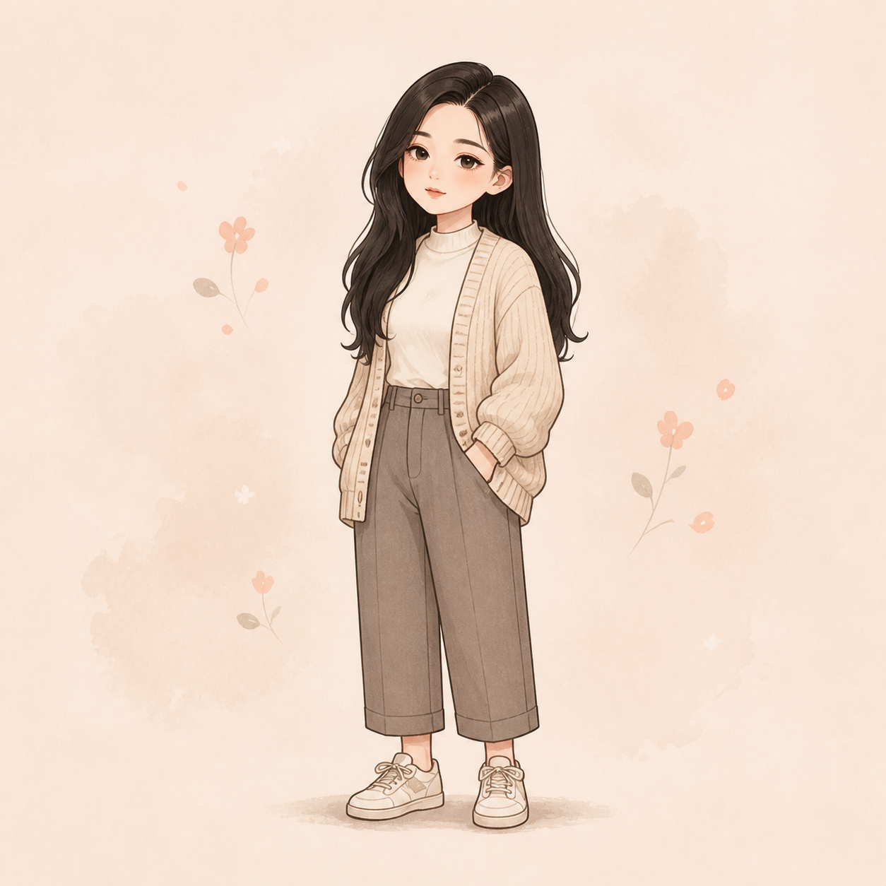

# 一张照片 / 一个账号，变成你的 IP ✨

先看 25 个角色方向，再选一个放大。不会画画也能玩。

## 先安装 👇

把**这个 GitHub 仓库链接**丢给 Codex，然后说：

```text
安装这个 Skill
```

安装完成后，直接在 Codex 里使用。

## 怎么玩 🪄

1. 丢给 Codex 任何它能理解的输入：照片、账号链接、本地文件夹、文件，或直接一句需求。
2. 看 25 个角色方向。
3. 回复编号，例如：`放大 15`。

```text
为这个参考图设计 IP
```

```text
https://x.com/你的账号
为这个账号设计人物 IP
```

```text
为 E:\你的文件夹 设计 IP
```

```text
我想要一个适合做 AI 内容的成年女性角色，干净、有一点酷
```

## 账号 → IP

输入：[@yang02010](https://x.com/yang02010)



选 `15` 👇



## 照片 → IP

原图 👇


25 个方向 👇



选 `01` 👇



## 两个小原则 ✅

- 照片负责头部特征和气质，不照搬衣服、姿势或真人比例。
- “放大”是重新画角色，保留你选中的 IP 比例，不会变成普通立绘。

样图均为设计草案，喜欢哪一格就继续改哪一格。
