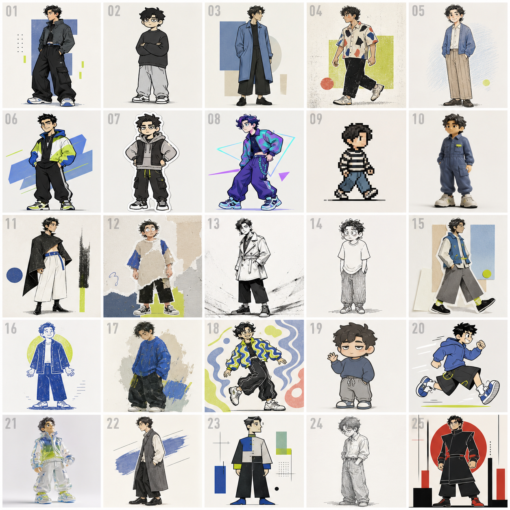
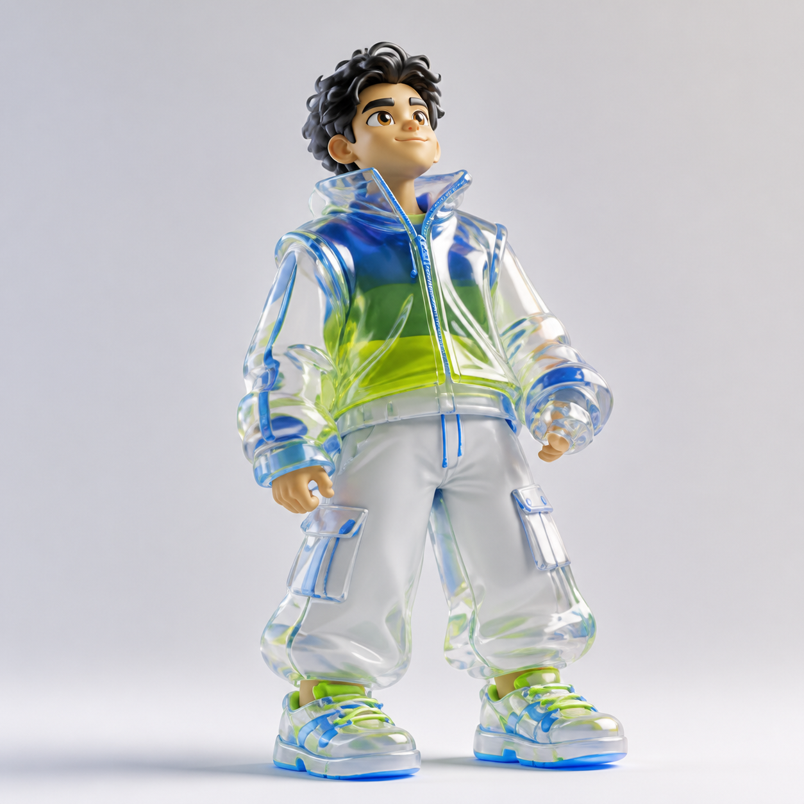
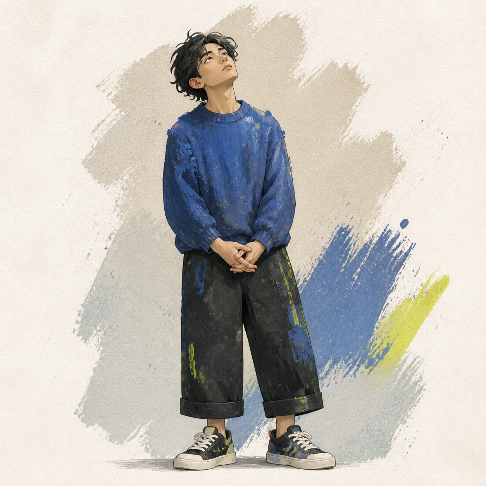
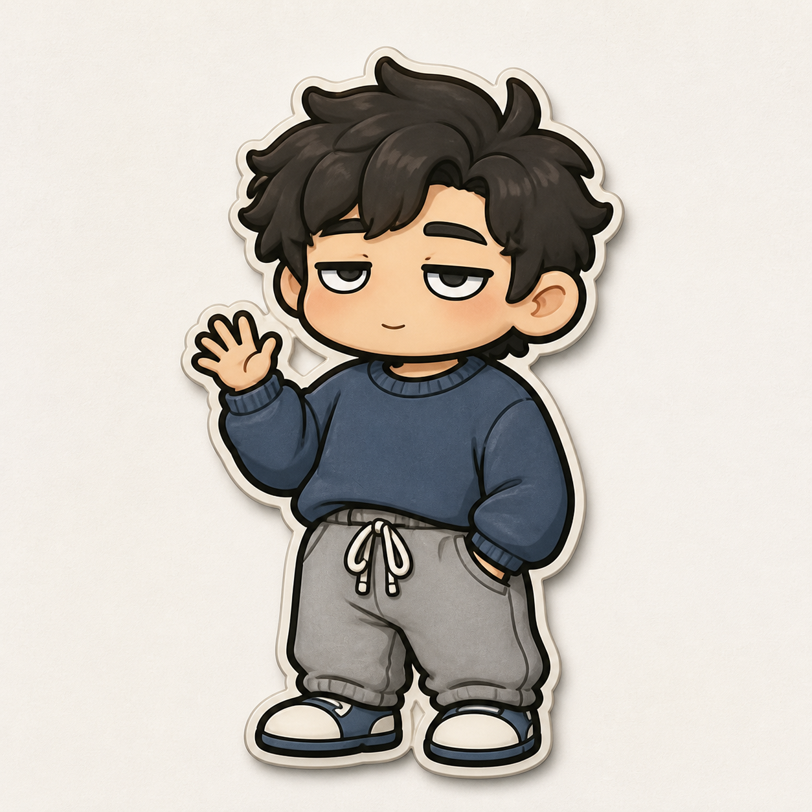

# Character IP：把你变成一个能长期使用的 IP

把账号、资料，或者一句需求交给 Codex。它会先给你一张 25 选 1 的人物 IP 海选板；看中哪个，输入编号，就能把它放大成单张精修图。

不需要会写提示词，也不需要懂画风、排版或设计软件。照着下面 4 步做就行。

## 你只需要准备一样东西

下面任选一个发给 Codex：

- 一个账号链接
- 一个资料文件夹
- 1–3 张人物照片
- 一句话需求，例如「为一个理性、爱讲 AI 的创作者设计人物 IP」

## 4 步开始

### 1. 安装 Skill

把下面这句话直接发给 Codex：

```text
请安装这个 Skill：https://github.com/yang0/character-ip
```

### 2. 丢给它你的素材或需求

账号、文件夹、照片、一句话需求都可以。直接复制一条发给 Codex：

```text
为这个账号设计人物 IP：https://x.com/example_creator
```

```text
为这个文件夹里的资料设计人物 IP：/你的资料文件夹
```

```text
设计一个人物 IP：理性、有点冷幽默、长期聊 AI 和创作的成年创作者。
```

### 3. 挑一张你最想要的

Codex 会输出一张 25 宫格 IP 海选板。把它当作试衣间：不用先想清楚画风，先看哪一格最像你想成为的那个角色。



### 4. 输入编号，直接放大

比如你喜欢 21 号，回复：

```text
21
```

Codex 会沿用这一格的画风、表情、服装轮廓和身体比例，输出一张可直接使用的单人 IP。

| 21 号 | 17 号 | 19 号 |
| :---: | :---: | :---: |
|  |  |  |

## 适合用来做什么？

- 账号头像与主页视觉
- 文章、课程、社媒内容配图
- 贴纸、表情包、周边的角色起点
- 为你的个人品牌先确定一张「长期好认」的脸

## 小提醒

这是一个**人物 IP** Skill：适合真人、创作者、账号人格或人物主题；不用于动物、吉祥物、植物、食物或物件 IP。

选中编号后还想调整？继续告诉 Codex「这个再改一下」，它会沿着你选中的方向继续精修，而不是重新抽一套画风。
